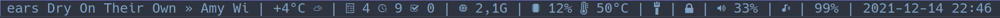

# sb-scripts

This repo contains some scripts I use for my dwm status bar. Each one
prints out one line of text with content descriped by the script name.
To use them, put them in your path. I use them with
[dwmblocks](https://github.com/ashish-yadav11/dwmblocks) but any status
bar that calls scripts that return the text to display should work just
as well.

Here's a screenshot of what it can look like when used with dwmblocks in
dwm with Nord theme:



Or as a GIF:


You need to install [Nerd Fonts](https://www.nerdfonts.com) for the
icons to display correctly, and set dwm to use it. In the screenshot I
use Nerd Font Hack Mono. An alternative method is to change the icons in
each script.

Some scripts use color codes to display color in the statusbar. This
requires the patch from the above mentioned dwmblocks fork (or anything
else that can interpret them). If you don't need color, you can remove
the color code from the scripts.

# Scripts

Here are explanations of the scripts, together with example output. If
you cannot see the icons, it means you don't use Nerd Font in your
browser.

## sb-bat

Shows percentage battery left and charge status if supported. Example of
correct output:

```
 100%
```

## sb-battery

Alternative script to show percentage battery left and charge status if
supported. Example of correct output:

```
99%
```

## sb-bluetooth

Shows whether a bluetooth audiodevice is connected. Requires pamixer.
Example of correct output:

```
﫽
```

## sb-cpu

Wrapper script for `sb-cpu-load` and `sb-cpu-temp`. Example of correct
output:

```
 7%  47°C
```

## sb-cpu-load

Shows usage percentage of CPU. Example of correct output:

```
2%
```

## sb-cpu-temp

Shows temperature of the cpu. Example of correct output:

```
49°C
```

## sb-mem

Shows memory usage. Example of correct output:

```
 2,2G
```

## sb-music

Shows the currently playing music, with a maximum width set by the
script. If run each second, it will show a "rolling text" so you can see
the full song information even if the block that holds the text is not
wide enough. Requires playerctl. Example of correct output:

```
 Andy Stott - Leaving
```

## sb-net

Show's whether you're connected to a network. You might need to grep for
different strings. Check what's right for your computer with `ip a`.
Example of correct output:

```

```

## sb-net-vpn

Show's whether you're connected to a network and a vpn. You might need
to grep for different strings. Check what's right for your computer with
`ip a`. Example of correct output:

```

```

This means wired connection is connected. If VPN is disconnected, there
will be a warning.

## sb-sys

Shows memory and CPU usage, but hides it when under certain thresholds.
Other thresholds determine the color of the output, with more "urgent"
colors for higher usage.

```
 26%  57°C
```
## sb-tasks

This shows information about your [Taskwarrior](taskwarrior.org/) tasks.
First number is the number of tasks due today, second is the number of
overdue tasks, and third is the number of tasks completed today. It also
shows rolling text of the active task, or otherwise the highest urgency
task if there is one. Example of correct output:

```
 4 鬒 9  0 | task » the started
```

"Today" is considered over at 4 in the morning the next day.

## sb-time

Shows the time. Example of correct output:

```
2021-12-14 23:09
```

## sb-torrent

Shows download and upload speeds of
[Transmission](https://transmissionbt.com) bittorrent client. Speeds are
show in human-readable format thanks to numfmt.

```
 43K
```

## sb-vol

Shows audio volume. Example of correct output:

```
 33%
```

## sb-vol-bt

Combines sb-bluetooth and sb-vol. Shows audio volume as percentage and
whether a bluetooth audio device is connected with an icon. Example of
correct output:

```
﫽 33%
```

## sb-vpn

Shows if vpn is connected. You might need to change what the script
greps for to fit with your own available connections. Example of correct
output:

```

```

## sb-weather

Shows weather information from yr.no. You have to change the coordinates
in the script to fit with your local settings. Example of correct
output:

```
+4°C 
```

# Licence

These scripts are likely too small to be covered by copyright but just
to be sure, I hereby release those of the scripts in this repo that I am
the author of to the public domain. It is clear from the comments in the
code when I'm not the author.
